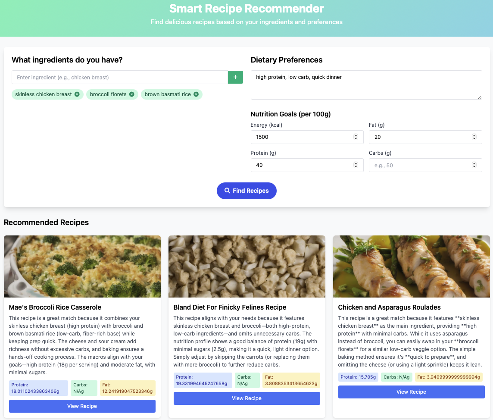

# 🍲 AI Recipe Recommender

A full-stack application for personalized recipe recommendations using advanced embeddings, nutritional analysis, and a modern web UI.

---

## Demo



---

## Features
- **Personalized Recommendations:** Suggests recipes based on your ingredients, dietary preferences, and nutrition goals.
- **Modern Web UI:** Fast, responsive UI (standalone HTML/JS or React, see below).
- **Powerful Backend:** Python Flask API with FAISS for fast similarity search and deep learning embeddings.
- **Rich Data:** Utilizes Recipe1M and custom embeddings for ingredients, instructions, and nutrition.

---

## Directory Structure
```
.
├── backend/         # Flask API, embedding models, and data
├── frontend/        # Frontend code and UIs
│   ├── public/      # Contains recipe_recommender_ui.html (main UI)
│   └── src/         # React app (optional, not main UI)
├── notebooks/       # Jupyter notebooks for data processing and analysis
├── scripts/         # Python scripts for preprocessing and utilities
├── data/
│   ├── embeddings/  # Embedding and FAISS index files
│   ├── processed/   # Processed numpy arrays
│   └── raw/         # Raw data files
├── models/          # Trained scalers and model artifacts
├── requirements.txt # (legacy, see backend/requirements.txt)
└── README.md        # (this file)
```

---

## Getting Started

### 1. Clone the Repository
```bash
git clone <your-repo-url>
cd 6.C511-Project
```

### 2. Backend Setup (Flask API)
```bash
cd backend
conda activate recipe_env  # or your preferred environment
pip install -r requirements.txt
python api_backend.py
```
- Make sure you have the required data files in `backend/` (see below).
- The API will run on `http://localhost:8000` by default.

### 3. Main UI (Standalone HTML)
The main user interface is a standalone HTML/JS app:

- Open `frontend/public/recipe_recommender_ui.html` directly in your browser (drag and drop, or File > Open).
- **Or** serve it locally (recommended for API calls to work):

```bash
cd frontend/public
python3 -m http.server 3000
```
- Then open [http://localhost:3000/recipe_recommender_ui.html](http://localhost:3000/recipe_recommender_ui.html) in your browser.

### 4. (Optional) React App
- The `frontend/src/` directory contains a React version of the UI, but the main UI is the HTML file above.
- To run the React app (for development or migration):
```bash
cd frontend
npm install
npm run dev
```
- The React app will be available at [http://localhost:5173](http://localhost:5173).

### 5. Data & Models
- Place your large data files (embeddings, indexes, etc.) in the correct folders as shown above.
- If you need to regenerate embeddings or indexes, use the notebooks in `notebooks/` and scripts in `scripts/`.

---

## Usage

### Web UI
- Open the standalone HTML UI as described above.
- Enter your available ingredients, dietary preferences, and nutrition goals.
- Click to get personalized recipe recommendations!

### API
- The backend exposes a `/api/recommend` endpoint (see `backend/api_backend.py`).
- Example request:
```json
POST /api/recommend
{
  "ingredients": ["chicken", "rice", "broccoli"],
  "dietary_preference": "high protein",
  "nutrition_goals": {"max_energy": 500},
  "top_k": 5
}
Headers: { "X-API-Key": "<your-api-key>" }
```

---

## Notebooks & Scripts
- `notebooks/main_preprocessing_embedding_Max.ipynb`: Main data preprocessing and embedding pipeline.
- `notebooks/main_query_embeddings.ipynb`: Query and test the embedding-based search.
- `notebooks/manual_filter.ipynb`: Manual filtering and preference parsing.
- `scripts/RecipePreprocessor.py`: Data cleaning and preprocessing utilities.
- `scripts/load_complete_df.py`: Data loading helpers.

---

## Contributing
Pull requests and issues are welcome! Please open an issue to discuss major changes.

## License
MIT License. See [LICENSE](LICENSE) for details.

---

## Credits
- Built by Max Knuth and contributors.
- Powered by [Flask](https://flask.palletsprojects.com/), [FAISS](https://github.com/facebookresearch/faiss), and [Recipe1M](https://pic2recipe.csail.mit.edu/). 
